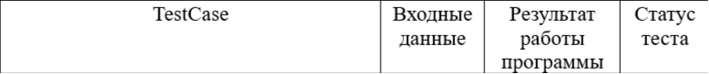
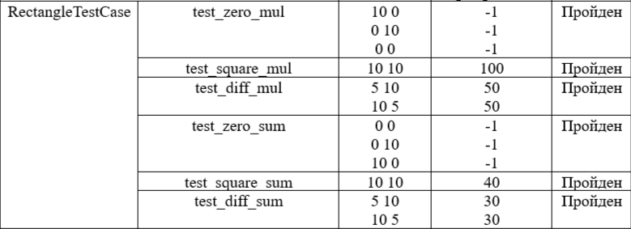
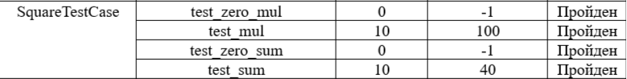
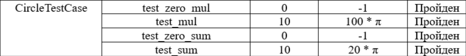
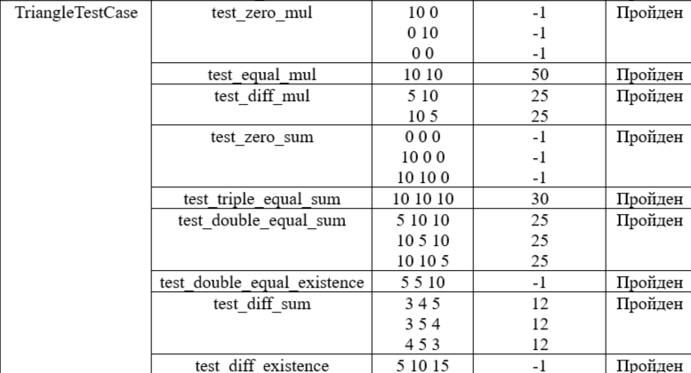

# **Документация по библиотеке _geometric_lib_**
## **Общее описание**
Написана для языка Python. 
Библиотека предоставляет возможности для работы с основными геометрическими фигурами. 
В неё входит 4 файла с описанием функций для следующих фигур:
- окружность (круг)
- прямоугольник
- квадрат
- треугольник
## **Описание функций с примерами вызова**
### **Функции файла _circle.py_**
Функции для вычисления характеристик окружности (круга)

#### `area(r)`

Принимает число - радиус окружности, возвращает площадь круга с заданным радиусом.

**Параметры:**

- `r` : радиус окружности (целое/вещественное число)

**Возвращаемое значение:**

- `math.pi * r * r` : площадь круга (вещественное число)

**Примеры вызова:**
```
print(area(5))   # 78.53981633974483
print(area(2.4)) # 18.09557368467721
```
#### `perimeter(r)`

Принимает число - радиус окружности, возвращает длину окружности с заданным радиусом.

**Параметры:**

- `r` : радиус окружности (целое/вещественное число)

**Возвращаемое значение:**

- `2 * math.pi * r` : длина окружности (вещественное число)

**Примеры вызова:**
```
print(perimeter(5))   # 31.41592653589793
print(perimeter(2.4)) # 15.079644737231007
```
### **Функции файла _rectangle.py_**
Функции для вычисления характеристик прямоугольника

#### `area(a, b)`

Принимает два числа - длины сторон прямоугольника, возвращает площадь прямоугольника с заданными сторонами.

**Параметры:**

- `a` : длина первой стороны прямоугольника (целое/вещественное число)
- `b` : длина второй стороны прямоугольника (целое/вещественное число)

**Возвращаемое значение:**

- `a * b` : площадь прямоугольника (целое/вещественное число)

**Примеры вызова:**
```
print(area(5, 6))     # 30
print(area(3, 2.4))   # 7.2
print(area(1.7, 9.2)) # 15.64
```
#### `perimeter(a, b)`

Принимает два числа - длины сторон прямоугольника, возвращает периметр прямоугольника с заданными сторонами.

**Параметры:**

- `a` : длина первой стороны прямоугольника (целое/вещественное число)
- `b` : длина второй стороны прямоугольника (целое/вещественное число)

**Возвращаемое значение:**

- `(a + b) * 2` : периметр прямоугольника (целое/вещественное число)

**Примеры вызова:**
```
print(perimeter(5, 6))     # 22
print(perimeter(3, 2.4))   # 10.8
print(perimeter(1.7, 9.2)) # 21.8
```
### **Функции файла _square.py_**
Функции для вычисления характеристик квадрата

#### `area(a)`

Принимает число - длину стороны квадрата, возвращает площадь квадрата с заданной стороной.

**Параметры:**

- `a` : длина стороны квадрата (целое/вещественное число)

**Возвращаемое значение:**

- `a * a` : площадь квадрата (целое/вещественное число)

**Примеры вызова:**
```
print(area(5))   # 25
print(area(2.4)) # 5.76
```
#### `perimeter(a)`

Принимает число - длину стороны квадрата, возвращает периметр квадрата с заданной стороной.

**Параметры:**

- `a` : длина стороны квадрата (целое/вещественное число)

**Возвращаемое значение:**

- `4 * a` : периметр квадрата (целое/вещественное число)

**Примеры вызова:**
```
print(perimeter(5))   # 20
print(perimeter(2.4)) # 9.6
```
### **Функции файла _triangle.py_**
Функции для вычисления характеристик треугольника

#### `area(a, h)`

Принимает два числа - длину основания треугольника и его высоту, возвращает площадь треугольника с заданными основанием и высотой.

**Параметры:**

- `a` : длина основания треугольника (целое/вещественное число)
- `h` : длина высоты треугольника (целое/вещественное число)

**Возвращаемое значение:**

- `a * h / 2` : площадь треугольника (вещественное число)

**Примеры вызова:**
```
print(area(5, 6))     # 15.0
print(area(3, 2.4))   # 3.6
print(area(2.4, 3))   # 3.6
print(area(1.7, 9.2)) # 7.82
```
#### `perimeter(a, b, c)`

Принимает три числа - длины сторон треугольника, возвращает периметр треугольника с заданными сторонами.

**Параметры:**

- `a` : длина первой стороны треугольника (целое/вещественное число)
- `b` : длина второй стороны треугольника (целое/вещественное число)
- `c` : длина третьей стороны треугольника (целое/вещественное число)

**Возвращаемое значение:**

- `a + b + c` : периметр треугольника (целое/вещественное число)

**Примеры вызова:**
```
print(perimeter(5, 6, 7))       # 18
print(perimeter(3, 2.4, 4))     # 9.4
print(perimeter(1.7, 5.2, 3.8)) # 10.7
```
## **Тестирование**
В проект добавлена папка `tests` с файлами unit-тестов продукта.
### **Файл _rectangle_test.py_**
`RectangleTestCase`

Включает 6 тестов для модуля `rectangle`:
- тестирование функции `area`:
    - `test_zero_mul` : нулевые значения параметров фигуры
    - `test_square_mul` : прямоугольник с равными сторонами
    - `test_diff_mul` : прямоугольник с разными сторонами
- тестирование функции `perimeter`:
    - `test_zero_sum` : нулевые значения параметров фигуры
    - `test_square_sum` : прямоугольник с равными сторонами
    - `test_diff_sum` : прямоугольник с разными сторонами

**Результаты тестов:**



### **Файл _square_test.py_**
`SquareTestCase`

Включает 4 теста для модуля `square`:
- тестирование функции `area`:
    - `test_zero_mul` : нулевые значения параметров фигуры
    - `test_mul` : ненулевая сторона
- тестирование функции `perimeter`:
    - `test_zero_sum` : нулевые значения параметров фигуры
    - `test_sum` : ненулевая сторона

**Результаты тестов:**



### **Файл _circle_test.py_**
`CircleTestCase`

Включает 4 теста для модуля `circle`:
- тестирование функции `area`:
    - `test_zero_mul` : нулевые значения параметров фигуры
    - `test_mul` : ненулевой радиус
- тестирование функции `perimeter`:
    - `test_zero_sum` : нулевые значения параметров фигуры
    - `test_sum` : ненулевой радиус

**Результаты тестов:**



### **Файл _triangle_test.py_**
`TriangleTestCase`

Включает 9 тестов для модуля `triangle`:
- тестирование функции `area`:
    - `test_zero_mul` : нулевые значения параметров фигуры
    - `test_equal_mul` : треугольник с высотой, равной основанию
    - `test_diff_mul` : треугольник с различными высотой и основанием
- тестирование функции `perimeter`:
    - `test_zero_sum` : нулевые значения параметров фигуры
    - `test_triple_equal_sum` : равносторонний треугольник
    - `test_double_equal_sum` : равнобедренный треугольник
    - `test_double_equal_existence` : несуществующий равнобедренный треугольник
    - `test_diff_sum` : разносторонний треугольник
    - `test_diff_existence` : несуществующий разносторонний треугольник

**Результаты тестов:**



## **История изменения проекта с хэшами коммитов**

- `8ba9aeb3cea847b63a91ac378a2a6db758682460` L-03: Circle and square added
- `d078c8d9ee6155f3cb0e577d28d337b791de28e2 (origin/new_features_465546, origin/main, origin/HEAD, main)` L-03: Docs added
- `41ee87607a02b019ab4d1be2af858c71237b7d57` new file on rectangle added
- `08475497dffe7e30322a82dbdf63c0beccf1e5cb` file on triangle added and error on rectangle fixed
- `ba348b9878d67c6e9117b2745b6a461a055ffc92` comments on functions in circle.py added
- `8f33efa3e5d22a2b88065d224a8629cfbbf0afcc` comments on functions in rectangle.py added
- `367ad6c89f4f6141958c54c87ed98e6aa4aeb821` comments on functions in square.py added
- `409c027e27f28c61fb3cc77712d493c6aaa4389e` comments on functions in triangle.py added
- `ca696325bf3e7da45e5a472852cf5895e9d405dc` minor cosmetic changes on rectangle.py and triangle.py
- `0beff003d049cd59c6a45e07de318c9566711425 (HEAD -> new_features_465546)` documentation added in readme file
- `9d946af9622d22d556abab3ba3271d66fca784a1 (origin/new_features_465546)` history of commits added to documentation
- `f4d472154f71ca5de9c701133eac40b08ec960fe` new test file on rectangle added
- `a2f09b71b95ad38b0df4f582488d29e49cb1b5d6` new test file on square added
- `af2413edd87d3a24d1e1db2887bc928addd5952d` new test file on circle added
- `56f26be13976cb315213ea3e37e4c606748f23aa` new test file on triangle added
- `8fce1a2681f46b443d5d240b9db407f776d46892` checking of invalid figures added
- `ec8005e23ca46c0435bf42687d5ad44562657829` all tests on invalid figures changed
- `c5c90eb213638da0eea85877ec48f8cef74e516c` information on tests added into readme
- `91ce5245de6f731709caf643cae2ce655375f528 (HEAD -> new_features_465546)` tests description added into readme
